

## 1.研究背景与意义

随着人口老龄化程度的不断加深，老年人的健康问题越来越受到关注。其中，老年人跌倒是一种常见但危险的事件，可能导致严重的身体损伤甚至死亡。因此，开发一种能够及时检测和预警老年人跌倒的系统具有重要的现实意义。

在过去的几十年里，计算机视觉技术取得了巨大的进步，尤其是在图像和视频处理方面。OpenCV作为一个开源的计算机视觉库，提供了丰富的图像处理和分析工具，被广泛应用于各个领域。基于OpenCV的人员跌倒检测系统能够利用计算机视觉技术实时监测和分析视频流，从而及时发现跌倒事件并进行预警。

该系统的研究意义主要体现在以下几个方面：

1. 提高老年人的安全性：老年人跌倒是导致伤害和死亡的主要原因之一。通过开发基于OpenCV的人员跌倒检测系统，可以及时发现老年人跌倒事件并及时采取救援措施，提高老年人的安全性。

2. 减轻护理负担：老年人跌倒后，需要及时的救援和护理。基于OpenCV的人员跌倒检测系统可以自动监测老年人的行为，一旦发现跌倒事件，可以立即向护理人员发送警报，减轻护理负担。

3. 促进智能化养老：随着人工智能技术的发展，智能化养老已经成为一个热门的研究方向。基于OpenCV的人员跌倒检测系统可以作为智能化养老的一部分，为老年人提供更加智能、便捷的生活服务。

4. 推动计算机视觉技术的应用：计算机视觉技术在人员跌倒检测系统中的应用，可以推动计算机视觉技术在其他领域的应用。通过研究基于OpenCV的人员跌倒检测系统，可以进一步提高计算机视觉技术的准确性和稳定性，为其他领域的应用提供技术支持。

总之，基于OpenCV的人员跌倒检测系统具有重要的现实意义和研究价值。通过该系统的研究和应用，可以提高老年人的安全性，减轻护理负担，促进智能化养老，并推动计算机视觉技术的应用和发展。

# 2.图片演示
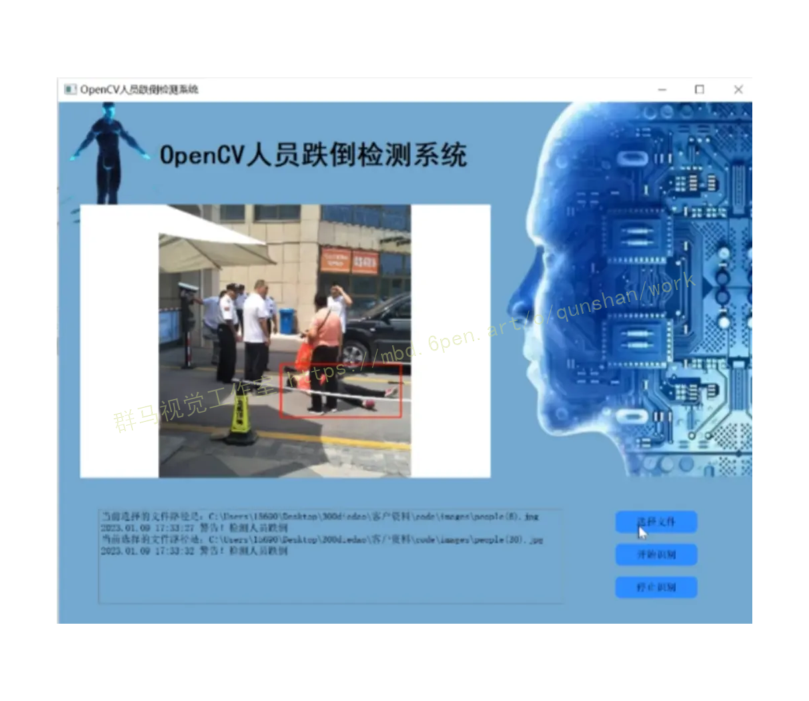

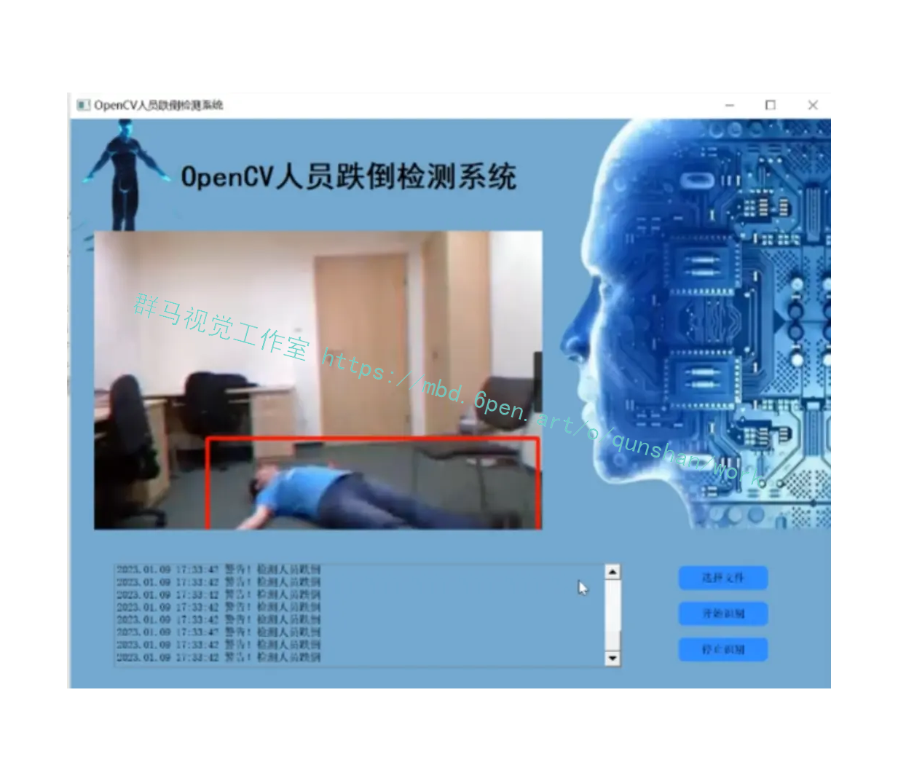

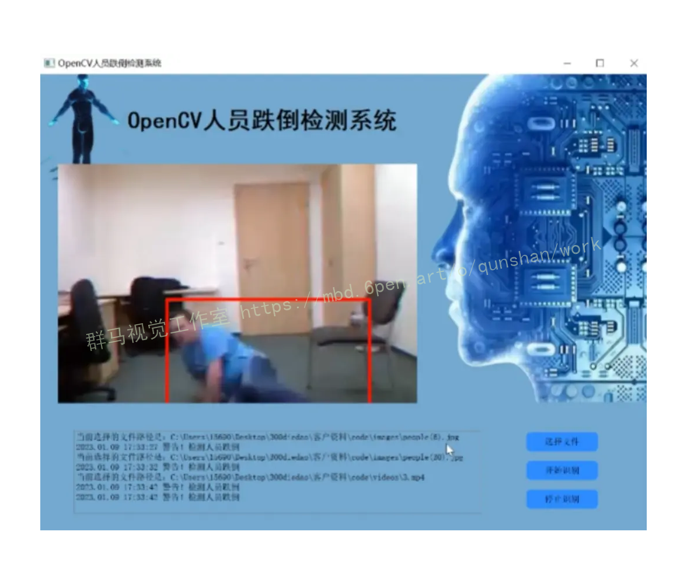

# 3.视频演示
[基于OpenCV的人员跌倒检测系统（源码＆部署教程）_哔哩哔哩_bilibili](https://www.bilibili.com/video/BV1ew411Q7hm/?vd_source=ff015de2d29cbe2a9cdbfa7064407a08)

# 4.图像预处理
#### 4.1 中值滤波
中值滤波法为非线性平滑方法，它主要是把图像中像素点的灰度值替换为这个像素相邻区域内其他像素点灰度值的中间值。对于有限的实数集，中值既是集合排序后中间的数值的值。在一定条件下，线性滤波都拥有低通滤波的特性，在降噪的时候可能会模糊图像边缘细节，中值滤波能够解决线性滤波在处理图像边缘时存在的问题，并且因为其冲激响应为零，使得它能够抑制脉冲干扰和图像扫描噪声,对消除椒盐噪声效果不错，但是如果图像拥有众多条纹，效果一般不理想。
中值滤波的步骤为:
1、通过滑动模板窗口，使其中心点和图像里的某个像素点保持重合;2、获取像素点灰度值;
3、把读取到的灰度值从小到大排序;
4、从排列好的数值中取出这些值的中值，接着把中值赋值给模板的中心像素点。如果这些排列好的序列总数是奇数，中值就为这些数值的中间那个像素的灰度值，如果是偶数，就是中间两个像素点的灰度值平均值。在实际处理中一般使用奇数模板，这样可以保证中值具有唯一性。
下面利用序列来理解中值滤波的原理32]，假定xx2x3...xn为一组数列，按照大小顺序排列为
i1 ≤Xi2 ≤Xi3 ≤...≤Xin
在OpenCV函数库中，cv2.medianBlur(src,ksize)可以对图像进行中值滤波处理，其中src为图像矩阵，Ksize为内核大小。对图3.1进行中值滤波处理，处理结果如下图3.3所示，从左至右内核大小分别为3、5、7，内核数值越大，得到的结果往往越模糊，而且在图中能够看到使用中值滤波处理后的图像在线条处丢失了较多的细节，图像中的字体依旧变得非常模糊。
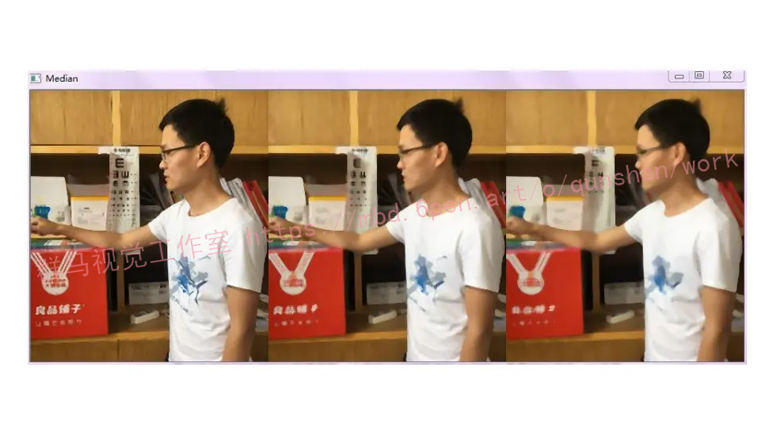

#### 4.2 阈值处理
本文后续的工作对于目标的检测，将会用到阈值处理提取目标人体，经过阈值处理后，一般只保留图像的关键信息，会使图像的目标更加明确，图像的像素拥有灰度相似性与灰度不连续性两种特性，图像同一区域内是像素拥有灰度相似性，不同区域的一般拥有灰度不连续性l34]。通过设置不同的阈值，可以把图像分离为不同的区域。
阈值处理它是通过预先设置好的阈值来划分图像像素，大于阈值的划分为一个区域，小于阈值的划分为另一个区域。它适用于目标与背景存在较大的灰度对比度，且目标与背景灰度单一的图像。但是这种方法比较依赖于灰度直方图，对于背景复杂的图像效果并不理想。根据对图像采用一个或多个阈值，可以分成全局阈值法和局部阈值法。根据阈值算法的自有特性又可以分为Р参数法、Otsu阈值法、迭代阈值法、双阈值法等。
(1)Р参数法
Р参数法根据目标区域在整个图像上占的比例设定阈值，然后进行二值化。假如已知了目标占到整幅图像的多少，这个时候便能够使用Р参数法，Р为比例值。Р参数法的步骤如下:
①计算出图像的直方图分布P(t)，t=0,1,2.....255。
②计算阈值T，m×n为图像大小。
(2)Otsu阈值法
Otus阈值法又名最大类间方差法，由Otsu在1978年提出，基本思想是根据图像的灰度特征把图像分成前景和背景两种，他们的类间方差最大时的阈值就是最优阈值。类间方差越大，前景与背景就越不一样，所以最大化类间方差法拥有很好的效果[36l。(3）迭代阈值法
迭代阈值法利用像素的相似性，先选择一个合适的开始阈值，接着使用某种方法不停的更新直到收敛，即直到找到相似的像素点。迭代阈值法简单且容易实现，拥有较好的执行速度。
(4)双阈值法
针对单阈值法的局限性，即图像的灰度直方图的双峰通常都会重叠，使用单阈值法会有较大误差。双阈值法是利用两个阈值T与T,来区分背景与目标，T,<T2，灰度值比T小的判定为背景，灰度值比T,大的判定为目标，两者之间的另外再做判断。
在获取运动目标的过程中，进过差分法会得到如图3.5的一张灰度图，利用阈值处理可以使目标特征更加的明确，从而可以进行后续的工作。Otsu法能够自动选择合适的阈值对图像进行分割，所以利用Otsu法进行处理不易产生错分的情况，使得该方法更加高效，是使用较多的方法之一。进行Otsu阈值处理可以得到如图的效果图。
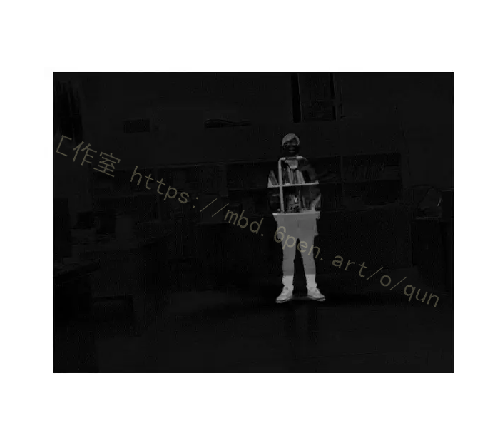
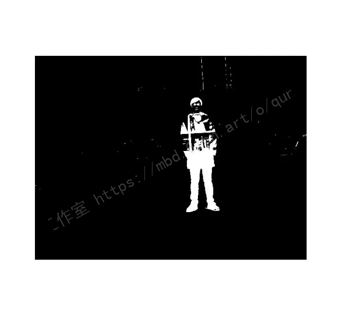


## 5.核心代码讲解

#### 5.1 bs.py

```python

class Bs:
    def __init__(self):
        self.settings = settings.Settings()
        self.method = self.settings.bsMethod

        if self.method == 0:
            self.fgbg = cv2.BackgroundSubtractorMOG2(self.settings.MOG2history, self.settings.MOG2thresh, self.settings.MOG2shadow)
            self.foregroundMask = None

        if self.method == 1:
            self.backgroundFrame = None
            self.frameCount = 1

    def updateBackground(self, frame):  # Updating the background
        if self.method == 0:
            self.foregroundMask = self.fgbg.apply(frame, self.foregroundMask, self.settings.MOG2learningRate)

        if self.method == 1:
            alpha = (1.0/self.frameCount)
            if self.backgroundFrame is None:
                self.backgroundFrame = frame
            self.backgroundFrame = cv2.addWeighted(frame, alpha, self.backgroundFrame, 1.0-alpha, 0)
            self.frameCount += 1

    def compareBackground(self, frame): 
        if self.method == 0:
            return self.foregroundMask

        if self.method == 1:
            self.frameDelta = cv2.absdiff(self.backgroundFrame, frame)
            self.foregroundMask = cv2.threshold(self.frameDelta, self.settings.thresholdLimit, 255, cv2.THRESH_BINARY)[1]  # Creating a foregroundMask
            return self.foregroundMask

    def deleteBackground(self):  
        if self.method == 0:
            self.foregroundMask = None

        if self.method == 1:
            self.backgroundFrame = None

    def resetBackgroundIfNeeded(self, frame):
        if self.method == 0:
            if self.foregroundMask is None:
                self.foregroundMask = self.fgbg.apply(frame)

        if self.method == 1:
            if self.backgroundFrame is None:
                self.updateBackground(frame)
                self.frameCount = 1
```

该程序文件名为bs.py，主要实现了一个名为Bs的类。该类用于进行背景减除操作，根据不同的方法选择不同的背景减除算法。

程序中使用了OpenCV库进行图像处理操作。在初始化方法中，根据设置文件中的bsMethod参数选择使用的背景减除方法。如果方法为0，则使用MOG2算法，如果方法为1，则使用动态方法。

在updateBackground方法中，根据选择的方法更新背景。如果方法为0，则使用MOG2算法的apply方法更新前景掩码。如果方法为1，则根据帧计数和权重参数更新背景帧。

在compareBackground方法中，根据选择的方法比较背景。如果方法为0，则返回前景掩码。如果方法为1，则计算帧差并根据阈值生成前景掩码。

在deleteBackground方法中，根据选择的方法删除背景。如果方法为0，则将前景掩码置为None。如果方法为1，则将背景帧置为None。

在resetBackgroundIfNeeded方法中，根据选择的方法重置背景。如果方法为0且前景掩码为None，则使用MOG2算法的apply方法初始化前景掩码。如果方法为1且背景帧为None，则更新背景帧并重置帧计数。

#### 5.2 fall_detection.py

```python

class MotionDetection:
    def __init__(self):
        self.cap = None
        self.fgbg = cv2.createBackgroundSubtractorKNN()
        self.consecutive_frames = 0

    def select_file(self):
        file_path = filedialog.askopenfilename()
        return file_path

    def use_webcam(self):
        self.cap = cv2.VideoCapture(0)

    def process_frame(self, frame):
        gray = cv2.cvtColor(frame, cv2.COLOR_BGR2GRAY)
        fgmask = self.fgbg.apply(gray)

        contours, _ = cv2.findContours(fgmask, cv2.RETR_TREE, cv2.CHAIN_APPROX_TC89_KCOS)

        if contours:
            areas = []
            heights = []
            widths = []
            for contour in contours:
                x, y, w, h = cv2.boundingRect(contour)
                ar = cv2.contourArea(contour)
                areas.append(ar)
                heights.append(h)
                widths.append(w)

            max_area = max(areas or [0])
            max_area_index = areas.index(max_area)

            cnt = contours[max_area_index]
            x, y, w, h = cv2.boundingRect(cnt)
            cv2.drawContours(fgmask, [cnt], 0, (255, 255, 255), 3)

            if h < w:
                self.consecutive_frames += 1

            aspect_ratio = h / w
            if self.consecutive_frames > 10 and aspect_ratio < 0.5:
                cv2.putText(fgmask, 'FALL', (x, y), cv2.FONT_HERSHEY_TRIPLEX, 0.5, (255, 255, 255), 2)

            cv2.rectangle(frame, (x, y), (x + w, y + h), (0, 0, 255), 2)

            if aspect_ratio >= 0.5:
                self.consecutive_frames = 0
                cv2.rectangle(frame, (x, y), (x + w, y + h), (0, 255, 0), 2)

            cv2.imshow('video', frame)

            if cv2.waitKey(2) & 0xff == ord('q'):
                return False
        else:
            return False

        return True

    def run(self):
        root = tk.Tk()
        root.withdraw()

        mode = input("Enter 'webcam' to use webcam or 'file' to select a file: ")

        if mode == 'webcam':
            self.use_webcam()
        elif mode == 'file':
            file_path = self.select_file()
            self.cap = cv2.VideoCapture(file_path)
        else:
            print("Invalid mode. Exiting program.")
            exit()

        while True:
            ret, frame = self.cap.read()

            if not ret:
                break

            if not self.process_frame(frame):
                break

        self.cap.release()
        cv2.destroyAllWindows()

```

这个程序是一个用于检测摔倒的程序。它使用OpenCV库来处理视频流或者从文件中读取视频，并使用背景减法算法来提取前景物体。然后，它通过计算轮廓的面积、高度和宽度来找到最大的轮廓，并绘制一个矩形框来标记该物体。如果检测到物体的高度小于宽度，并且连续帧数超过10帧且高宽比小于0.5，则将"FALL"标签添加到图像上。程序会在一个窗口中显示视频，并在按下"q"键时退出程序。

#### 5.3 main.py

```python


class FallDetector:
    def __init__(self, video_path):
        self.video = video.Video(video_path)
        time.sleep(0.5)
        self.video.nextFrame()
        self.video.testBackgroundFrame()
    
    def run(self):
        while True:
            try:
                self.video.nextFrame()
                self.video.testBackgroundFrame()
                self.video.updateBackground()
                self.video.compare()
                self.video.showFrame()
                self.video.testSettings()
                if self.video.testDestroy():
                    sys.exit()
            except Exception as e:
                break

```

这个程序文件是一个摔倒检测器的主程序。它使用了一个名为"video"的自定义模块来处理视频流。程序首先导入了必要的库和模块，然后创建了一个名为"video"的视频对象，指定了要处理的视频文件路径。接着程序进入一个循环，不断获取下一帧视频，对帧进行处理并更新背景模型。然后，程序进行比较，显示帧，并进行一些设置的测试。如果检测到程序需要终止，则退出程序。

#### 5.4 person.py

```python
class Person(object):
    """Person"""
    amount = 0

    def __init__(self, x, y, w, h, movementMaximum, movementMinimum, movementTime):
        self.x = x
        self.y = y
        self.w = w
        self.h = h
        self.movementTime = movementTime
        self.movementMaximum = movementMaximum
        self.movementMinimum = movementMinimum
        self.lastmoveTime = 0
        self.alert = 0
        self.alarmReported = 0
        self.lastseenTime = 0
        self.remove = 0
        Person.amount += 1
        if Person.amount > 1000:  # If person amount > 1000, set amount to 0
            Person.amount = 0
        self.id = Person.amount

    def samePerson(self, x, y, w, h):  # To Check if its the same person in the frame
        same = 0
        if x+self.movementMaximum > self.x and x-self.movementMaximum < self.x:
            if y+self.movementMaximum > self.y and y-self.movementMaximum < self.y:
                same = 1
        return same

    def editPerson(self, x, y, w, h):  # To Check 
        if abs(x-self.x) > self.movementMinimum or abs(y-self.y) > self.movementMinimum or abs(w-self.w) > self.movementMinimum or abs(h-self.h) > self.movementMinimum:
            self.lastmoveTime = 0
        self.x = x
        self.y = y
        self.w = w
        self.h = h
        self.lastseenTime = 0

    def getId(self):   # To get the id of the person
        return self.id

    def tick(self):
        self.lastmoveTime += 1  # Lastmovetime
        self.lastseenTime += 1  # Lastseentime
        if self.lastmoveTime > self.movementTime:
            self.alert = 1
        if self.lastseenTime > 4: # how many frames ago last seen
            self.remove = 1

    def getAlert(self):  # Raise an alert function
        return self.alert

    def getRemove(self):  
        return self.remove


class Persons:
    def __init__(self, movementMaximum, movementMinimum, movementTime):
        self.persons = []  # Making an empty list of persons
        self.movementMaximum = movementMaximum
        self.movementMinimum = movementMinimum
        self.movementTime = movementTime
        Person.amount = 0   # Initial count of person

    def addPerson(self, x, y, w, h):
        person = self.familiarPerson(x, y, w, h)
        if person:  # if its the same person edit the coordinates and w, h
            person.editPerson(x, y, w, h)
            return person
        else:       # Else append the person to the list
            person = Person(x ,y ,w ,h , self.movementMaximum, self.movementMinimum, self.movementTime)
            self.persons.append(person)
            return person

    def familiarPerson(self, x, y, w, h):  # To check if its the same person
        for person in self.persons:
            if person.samePerson(x, y, w, h):
                return person
        return None

    def tick(self):
        for person in self.persons:
            person.tick()
            if person.getRemove():
                self.persons.remove(person)
```

这个程序文件名为person.py，它定义了两个类：Person和Persons。

Person类代表一个人，具有以下属性：
- x, y, w, h：人的位置和尺寸
- movementTime：人的移动时间
- movementMaximum：人的最大移动范围
- movementMinimum：人的最小移动范围
- lastmoveTime：上次移动的时间
- alert：是否发出警报
- alarmReported：是否报告了警报
- lastseenTime：上次被观察到的时间
- remove：是否需要移除
- id：人的唯一标识符

Person类还有以下方法：
- samePerson：检查是否是同一个人
- editPerson：编辑人的属性
- getId：获取人的标识符
- tick：更新人的状态
- getAlert：获取警报状态
- getRemove：获取移除状态

Persons类代表多个人的集合，具有以下属性：
- persons：人的列表
- movementMaximum：人的最大移动范围
- movementMinimum：人的最小移动范围
- movementTime：人的移动时间

Persons类还有以下方法：
- addPerson：添加一个人到集合中
- familiarPerson：检查是否是同一个人
- tick：更新集合中每个人的状态

#### 5.5 settings.py

```python
class Settings(object):
    def __init__(self):
        self.debug = 1
        self.source = 0
        self.bsMethod = 1
        self.MOG2learningRate = 0.001
        self.MOG2shadow = 0
        self.MOG2history = 100
        self.MOG2thresh = 20
        self.minArea = 50*50
        self.thresholdLimit = 20
        self.dilationPixels = 30
        self.useGaussian = 1
        self.useBw = 1
        self.useResize = 1
        self.gaussianPixels = 31
        self.movementMaximum = 75
        self.movementMinimum = 3
        self.movementTime = 35
        self.location = 'Viikintie 1'
        self.phone = '01010101010'
```

这个程序文件名为settings.py，它定义了一个名为Settings的类。这个类有一个构造函数__init__()，用于初始化类的属性。

类的属性包括：
- debug：一个布尔值，用于调试目的。
- source：相机源。
- bsMethod：一个整数，表示在bs.py中选择的方法。
- MOG2learningRate：一个浮点数，表示MOG2学习率。
- MOG2shadow：一个整数，表示MOG2阴影。
- MOG2history：一个整数，表示MOG2历史。
- MOG2thresh：一个整数，表示MOG2阈值。
- minArea：一个整数，表示被视为人的最小面积。
- thresholdLimit：一个整数，表示阈值限制。
- dilationPixels：一个整数，表示膨胀像素。
- useGaussian：一个布尔值，表示是否使用高斯。
- useBw：一个布尔值，表示是否使用黑白。
- useResize：一个布尔值，表示是否使用调整大小。
- gaussianPixels：一个整数，表示高斯像素。
- movementMaximum：一个整数，表示仍然被视为同一个人的最大移动量。
- movementMinimum：一个整数，表示不触发警报的最小移动量。
- movementTime：一个整数，表示警报触发后的帧数。
- location：一个字符串，表示位置。
- phone：一个字符串，表示电话号码。

这个类的作用是设置和存储各种参数和设置，用于一个跌倒检测器的程序。

#### 5.6 video.py

```python

class Video:
    def __init__(self, path):
        self.settings = settings.Settings()
        self.camera = cv2.VideoCapture(path)
        self.bs = bs.Bs()
        self.persons = person.Persons(self.settings.movementMaximum, self.settings.movementMinimum, self.settings.movementTime)
        self.start = time.time()
        self.webservice = webservice.Webservice(self.settings.location, self.settings.phone)
        self.errorcount = 0
        self.alertLog = []
        self.frameCount = 1

    def nextFrame(self):
        grabbed, self.frame = self.camera.read()
        if not grabbed:
            self.destroyNow()
        self.convertFrame()

    def showFrame(self):
        if self.settings.debug:
            cv2.imshow("Thresh", self.thresh)
        cv2.imshow("Feed", self.frame)

    def destroyNow(self):
        self.camera.release()
        cv2.destroyAllWindows()

    def testDestroy(self):
        key = cv2.waitKey(1) & 0xFF
        if key == ord("q"):
            self.destroyNow()
            return 1
        else:
            return 0

    def resetBackgroundFrame(self):
        grabbed, self.frame = self.camera.read()
        self.convertFrame()
        self.bs.resetBackgroundIfNeeded(self.frame)
        self.persons = person.Persons(self.settings.movementMaximum, self.settings.movementMinimum, self.settings.movementTime)

    def testBackgroundFrame(self):
        key = cv2.waitKey(1) & 0xFF
        if key == ord("n"):
            self.bs.deleteBackground()

    def updateBackground(self):
        self.bs.updateBackground(self.frame)

    def testSettings(self):
        key = cv2.waitKey(1) & 0xFF
        if key == ord("0"):
            self.settings.minArea += 50
            print("minArea: " , self.settings.minArea)
        if key == ord("9"):
            self.settings.minArea -= 50
            print("minArea: " , self.settings.minArea)
        if key == ord("8"):
            self.settings.dilationPixels += 1
            print("dilationPixels: " , self.settings.dilationPixels)
        if key == ord("7"):
            self.settings.dilationPixels -= 1
            print("dilationPixels: " , self.settings.dilationPixels)
        if key == ord("6"):
            self.settings.thresholdLimit += 1
            print("thresholdLimit: " , self.settings.thresholdLimit)
        if key == ord("5"):
            self.settings.thresholdLimit -= 1
            print("thresholdLimit: " , self.settings.thresholdLimit)
        if key == ord("4"):
            self.settings.movementMaximum += 1
            print("movementMaximum: " , self.settings.movementMaximum)
        if key == ord("3"):
            self.settings.movementMaximum -= 1
            print("movementMaximum: " , self.settings.movementMaximum)
        if key == ord("2"):
            self.settings.movementMinimum += 1
            print("movementMinimum: " , self.settings.movementMinimum) 
        if key == ord("1"):
            self.settings.movementMinimum  -= 1
            print("movementMinimum: " , self.settings.movementMinimum) 
        if key == ord("o"):
            if self.settings.useGaussian:
                self.settings.useGaussian = 0
                print("useGaussian: off")
                self.resetbackgroundFrame()
            else:
                self.settings.useGaussian = 1
                print("useGaussian: on")
                self.resetbackgroundFrame()
        if key == ord("+"):
            self.settings.movementTime += 1
            print("movementTime: " , self.settings.movementTime)
        if key == ord("p"):
            self.settings.movementTime -= 1
            print("movementTime : " , self.settings.movementTime)

    def convertFrame (self):
        if self.settings.useResize:
            r = 750.0 / self.frame.shape[1]
            dim = (750, int(self.frame.shape[0] * r))
            self.frame = cv2.resize(self.frame, dim, interpolation = cv2.INTER_AREA)
        if self.settings.useBw:
            self.frame = cv2.cvtColor(self.frame, cv2.COLOR_BGR2GRAY)
        if self.settings.useGaussian:
            self.frame = cv2.GaussianBlur(self.frame, (self.settings.gaussianPixels, self.settings.gaussianPixels), 0)

    def compare(self):
        self.thresh = self.bs.compareBackground(self.frame)
        self.thresh = cv2.dilate(self.thresh, None, iterations=self.settings.dilationPixels)
        contours, _ = cv2.findContours(self.thresh.copy(), cv2.RETR_EXTERNAL, cv2.CHAIN_APPROX_SIMPLE)

        self.persons.tick()

        detectStatus = "idle"

        for contour in contours:
            if cv2.contourArea(contour) < self.settings.minArea:
                continue

            (x, y, w, h) = cv2.boundingRect(contour)

            person = self.persons.addPerson(x, y, w, h)
            color = (0, 255, 0)
            if person.alert:
                color = (0, 0, 255)
                cv2.line(self.frame, (x, y), (x + w, y + h), color, 2)
                cv2.line(self.frame, (x + w, y), (x , y + h), color, 2)
                detectStatus = "Alarm, not moving"
                if not person.alarmReported:
                    self.webservice.alarm("not moving", person.id)
                    person.alarmReported = 1

            cv2.rectangle(self.frame, (x, y), (x + w, y + h), color, 2)
            cv2.putText(self.frame, "{}".format(cv2.contourArea(contour)), (x, y+h+20), cv2.FONT_HERSHEY_SIMPLEX, 0.7, color, 1)
            cv2.putText(self.frame, "{} : {}".format(person.id, person.lastmoveTime), (x, y+20), cv2.FONT_HERSHEY_SIMPLEX, 0.8, color, 1)

        if self.settings.debug:
            self.end = time.time()
            seconds = self.end - self.start
            fps  = round((1 / seconds), 1)
            self.start = time.time()

            cv2.putText(self.frame, "Status: {}".format(detectStatus), (10, 20), cv2.FONT_HERSHEY_SIMPLEX, 0.8, (0, 140, 255), 1)
            cv2.putText(self.frame, "FPS: {}".format(fps), (400, 20), cv2.FONT_HERSHEY_SIMPLEX, 0.8, (0, 140, 255), 1)

    def newLightconditions(self):
        self.errorcount += 1
        if self.errorcount > 10:
            time.sleep(1.0)
            self.resetBackgroundFrame()
            self.errorcount = 0
```

这个程序文件名为video.py，它是一个用于检测摔倒的视频类。它包含了一些功能和类，如设置、人物、网络服务和背景差分等。在初始化函数中，它接受一个路径参数，用于指定视频源。它还创建了一个摄像头对象和一个背景差分对象。它还初始化了一些变量，如开始时间、错误计数和警报日志等。它还定义了一些方法，如获取下一帧、显示帧、销毁帧等。它还定义了一些用于测试和设置的方法，如重置背景帧、更新背景、测试设置等。最后，它定义了一个用于比较帧和检测人物的方法。在这个方法中，它比较当前帧和背景帧的差异，并找到轮廓。然后，它根据轮廓的面积和移动时间判断是否发生了摔倒，并根据情况报警。它还显示了一些HUD信息，如状态和FPS。如果检测到光照条件发生变化，它会重置背景帧。

## 6.系统整体结构

整体功能和构架概述：
该程序是一个用于检测摔倒的系统，通过处理视频流来实时监测人体的状态。它使用背景差分算法来提取前景物体，并通过比较轮廓的面积和移动时间来判断是否发生了摔倒。如果检测到摔倒事件，系统会触发警报并记录日志。程序的整体构架包括多个模块和类，如背景差分模块、人物类、设置类、视频类和网络服务类。

下面是每个文件的功能整理：

| 文件名 | 功能 |
| --- | --- |
| bs.py | 实现背景减除操作，根据选择的方法更新、比较、删除和重置背景。 |
| fall_detection.py | 检测摔倒事件，通过提取前景物体并计算轮廓的面积和移动时间来判断是否发生了摔倒。 |
| ui.py | 程序的主程序，创建视频对象并循环处理视频帧，更新背景模型并进行摔倒检测。 |
| person.py | 定义了人物类和人物集合类，用于管理和跟踪检测到的人物。 |
| settings.py | 定义了设置类，用于存储和管理程序的各种参数和设置。 |
| video.py | 实现了视频类，用于处理视频流，包括获取帧、显示帧、检测摔倒事件等功能。 |
| webservice.py | 实现了网络服务类，用于接收和处理来自其他系统的请求，并提供摔倒事件的警报和日志记录。 |

以上是对重点文件功能的简要概括。每个文件在整个系统中扮演不同的角色，共同构成了一个完整的摔倒检测系统。

# 7.运动目标检测 
目标检测是计算机视觉技术的重要组成部分，在目标检测过程中，计算机能否自动且准确的检测到目标，并且拥有快速性及鲁棒性及其重要。现阶段目标检测算法虽然还有一些不足，但是已经广泛的应用在安全监控、智能交通、医疗诊断及视觉导航等领域之中。本小节主要介绍运动目标检测一些常用算法及其使用。
运动目标检测是指通过某种方法将一系列图像里变化的部分给检测出来，并把运动目标提取出来的过程39][2]。运动目标检测是计算机视觉应用的基础，在目标定位，目标跟踪，目标分类等后期处理中非常关键。视频摄像头可以分成移动式与固定式，使得目标检测方法也可以分成静态背景下的检测与运动背景下的检测两种，现实生活中，由于大部分监控的摄像头都是固定不变的，所以本小节主要对静态背景下的运动检测进行研究。在此状态下，常用的检测方法有光流法、帧间差分法、背景减除法等[4]。
(1)光流法
物体在空间里的运动可以用运动场来表示，运动场变化引起的光线的变化透过视网膜,从而让人们看到物体的运动，由于这种光线的变化像流水一样，所以 Gisbon在1950年首次提出了光流的概念。后来研究人员将光流的概念引入到计算机视觉中，把图像的灰度变化与二维速度场相联系，由于摄像头所捕捉到的图像也是二维且连续的，所以图像上的光流场就反映了像素点在图像平面上的运动速度与幅度。运动的物体在图像上可以由像素值的灰度变化来表示，假设在现实场景下，一个不变的点在图像上的投影像素点的瞬时灰度值是不会变的[1]。
(2)背景减除法
背景减除法的主要思想是把包含目标的视频图像帧与不包含目标的背景帧做差分运算，最后得到目标[3]。背景减除法也比较常用于目标分割中。要利用背景减除法，首先应该进行背景建模，且背景图像也要进行实时更新。背景模型必须具有自适应性，这样才能最大限度的降低场景的动态变化对运动目标检测的影响。常用的背景建模方法有线性卡尔曼滤波法和混合高斯模型等。
把背景灰度图像用B(x, y)表示，当前图像帧用C(x,y)表示，差分图像用D(x,y)表示。背景减除法过程可以描述为:
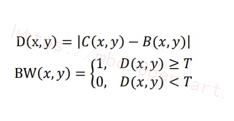

式中BW(x,y)表示二值图像，T为阈值。
背景减除法广泛应用于实时的视觉跟踪系统中，检测的过程中能够实时的确定目标的位置、形状等信息特征，并且准确度也较高。但是，背景减除法对背景的依赖比较高，容易受光线等环境因素变化的影响。因为背景建模的时间与当前帧所在时间有一定的时间间隔，背景已经发生了较大的变化，所以对检测结果也会有较大的影响。
下图为背景图，图为有人体目标的运动图，利用背景减除法提取目标，提取之后进行阈值处理，然后可以如图所示的效果图。由于人体皮肤与背景中的柜子颜色较为类似，且存在一些光线的干扰，图中存在较多的噪声，后续可以利用形态学处理减少噪声，突出目标人体。利用形态学对图进行预处理，所得结果如图。可以看出人体目标更加突出明显。
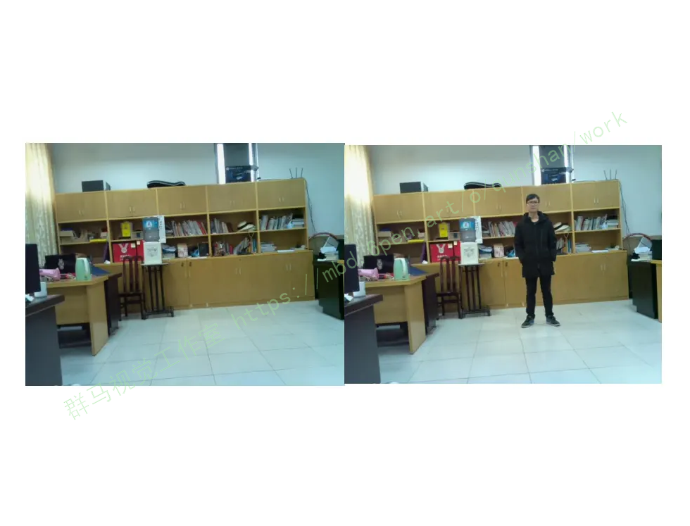
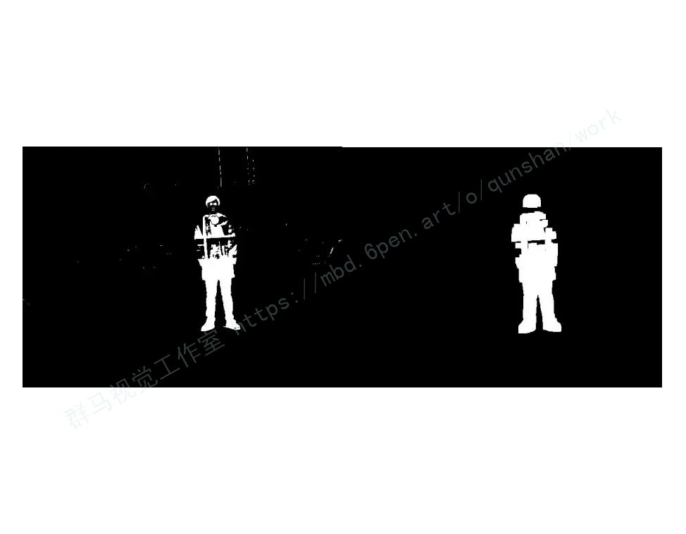

# 8.人体宽高比
当一个人站立的时候，他的高度一定比宽度大，当他跌倒后，宽度就会比高度大。使用这个特性可以对人体的活动状态进行检测。人体宽高比(WH-Ratio)的定义为:人体最小外接矩阵的宽度与高度的比值，人体最小外接矩阵即完全包围人体面积的最小矩形框。如果人体未跌倒，人体宽高比就会远小于1，如果跌倒了，且处于跌倒状态，人体宽高比就会远大于1。所以可以把人体宽高比的阈值设定为1。
下图为做跌倒检测时的人体摔倒实验图,绿色矩形框为人体最小外接矩阵。如图所示，人体在站立的状态下，人体最小外接矩阵的高度大于其宽度。图中人体跌倒后，外接矩阵的宽度大于高度。
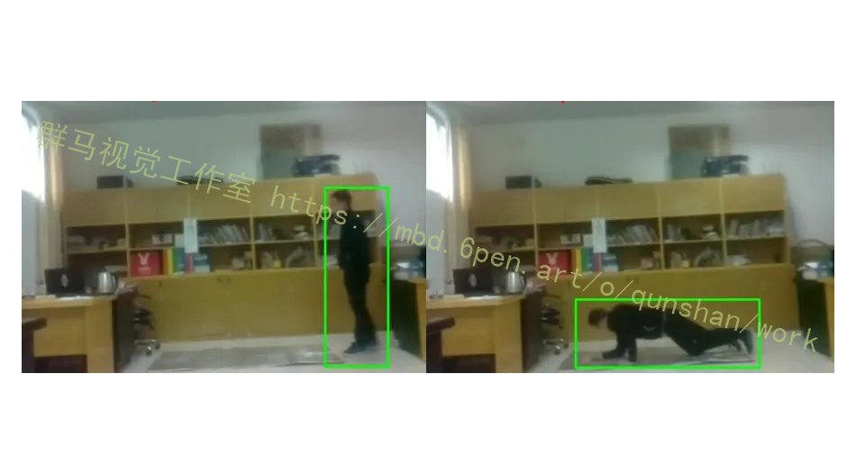

# 9.中心变化
对于类似于深蹲捡东西等动作，可能会出现同时满足人体宽高比与有效面积比的情况，为了解决这个干扰问题，可以采用中心变化率来作为判断依据。做深蹲动作时，视频前后两帧的人体中心点的距离会变大，两点连线的斜率也会发生变化。假设跌倒前后两帧的人体中心坐标分别为（x，yo)，(x1，y)，则斜率k为
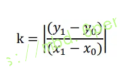

在平常活动中，斜率会趋近于0，而在人体深蹲时斜率会变大，且趋向于无穷大，而当人摔倒时，斜率k是不可能趋向于无穷大的。利用这个特性，可以排除人体在深蹲或起身时造成的跌倒误判。另外，两点之间的距离|AB(可以用来作为辅助判断，在人跌倒的瞬间往往时间非常短，而在平常人体移动的较慢，如果在相对比较短的时间内|ABl非常大，说明极有可能是摔倒了。
文献[5]利用身体轮廓边缘的像素点来计算人体的中心，求取过程稍微有些麻烦，本文取人体最小外接矩阵的对角线交点来近似作为人体的中心。如下图所示:
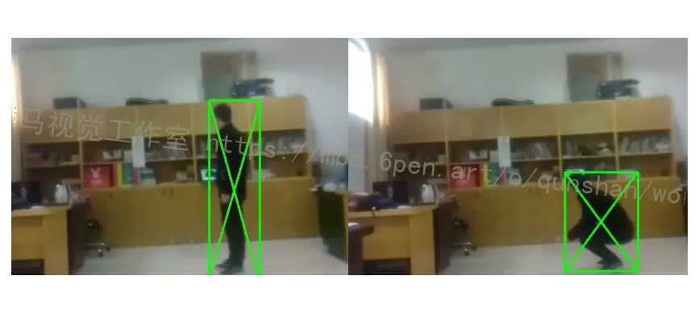

# 10.算法流程图
首先从视频流中获取图像信息，对图像进行预处理，包括图像的二值化来获得灰度图像，利用高斯滤波读图像进行平滑处理，减少图像噪声。利用背景减除法获取人体大概轮廓，进一步进行图像处理，去除噪声及阈值处理，然后对图像进行形态学处理，获得更加清晰的轮廓。获取人体最小外接矩阵，对矩阵信息进行判断，是否满足宽高比阈值即宽高比大于1,不满足则处理下一帧图像,满足则进行有效面积比与中心变化判断，排除一些特殊动作与活动的情况，全部条件满足，则表示有人摔倒，最后输出信号，发出警告。如果都不满足，则不断获取下帧图像进行判断。如图为改进的跌倒算法流程图。
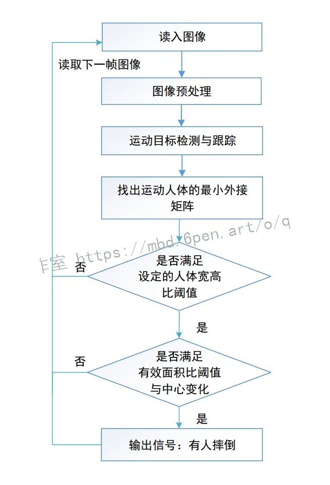

# 11.系统整合
下图[完整源码＆环境部署视频教程＆自定义UI界面](https://s.xiaocichang.com/s/b2e902)


参考博客[《基于OpenCV的人员跌倒检测系统（源码＆部署教程）》](https://mbd.pub/o/qunshan/work)

# 12.参考文献
---
[1][陈玮](https://s.wanfangdata.com.cn/paper?q=%E4%BD%9C%E8%80%85:%22%E9%99%88%E7%8E%AE%22),[周晴](https://s.wanfangdata.com.cn/paper?q=%E4%BD%9C%E8%80%85:%22%E5%91%A8%E6%99%B4%22),[曹桂涛](https://s.wanfangdata.com.cn/paper?q=%E4%BD%9C%E8%80%85:%22%E6%9B%B9%E6%A1%82%E6%B6%9B%22).[基于SVM和阈值分析法的摔倒检测系统](https://d.wanfangdata.com.cn/periodical/jsjyyyrj201707035)[J].[计算机应用与软件](https://sns.wanfangdata.com.cn/perio/jsjyyyrj).2017,(7).DOI:10.3969/j.issn.1000-386x.2017.07.034.

[2][张立](https://s.wanfangdata.com.cn/paper?q=%E4%BD%9C%E8%80%85:%22%E5%BC%A0%E7%AB%8B%22),[王渊民](https://s.wanfangdata.com.cn/paper?q=%E4%BD%9C%E8%80%85:%22%E7%8E%8B%E6%B8%8A%E6%B0%91%22).[基于核函数的非线性支持向量机](https://d.wanfangdata.com.cn/periodical/kjzw201701274)[J].[科技展望](https://sns.wanfangdata.com.cn/perio/kjzw).2017,(1).

[3][詹志宇](https://s.wanfangdata.com.cn/paper?q=%E4%BD%9C%E8%80%85:%22%E8%A9%B9%E5%BF%97%E5%AE%87%22),[安友军](https://s.wanfangdata.com.cn/paper?q=%E4%BD%9C%E8%80%85:%22%E5%AE%89%E5%8F%8B%E5%86%9B%22),[崔文超](https://s.wanfangdata.com.cn/paper?q=%E4%BD%9C%E8%80%85:%22%E5%B4%94%E6%96%87%E8%B6%85%22).[图像阈值分割算法及对比研究](https://d.wanfangdata.com.cn/periodical/hbydjs201704044)[J].[信息通信](https://sns.wanfangdata.com.cn/perio/hbydjs).2017,(4).

[4][刘继元](https://s.wanfangdata.com.cn/paper?q=%E4%BD%9C%E8%80%85:%22%E5%88%98%E7%BB%A7%E5%85%83%22).[基于树莓派的物联网应用](https://d.wanfangdata.com.cn/periodical/dzsj201608021)[J].[电子世界](https://sns.wanfangdata.com.cn/perio/dzsj).2016,(8).

[5][高青](https://s.wanfangdata.com.cn/paper?q=%E4%BD%9C%E8%80%85:%22%E9%AB%98%E9%9D%92%22),[陈洪波](https://s.wanfangdata.com.cn/paper?q=%E4%BD%9C%E8%80%85:%22%E9%99%88%E6%B4%AA%E6%B3%A2%22),[冯涛](https://s.wanfangdata.com.cn/paper?q=%E4%BD%9C%E8%80%85:%22%E5%86%AF%E6%B6%9B%22),等.[老年人跌倒检测系统的研究现状与发展趋势](https://d.wanfangdata.com.cn/periodical/ylwszb201512032)[J].[医疗卫生装备](https://sns.wanfangdata.com.cn/perio/ylwszb).2015,(12).DOI:10.7687/J.ISSN1003-8868.2015.12.102.

[6][宋菲](https://s.wanfangdata.com.cn/paper?q=%E4%BD%9C%E8%80%85:%22%E5%AE%8B%E8%8F%B2%22),[薛质](https://s.wanfangdata.com.cn/paper?q=%E4%BD%9C%E8%80%85:%22%E8%96%9B%E8%B4%A8%22).[基于OpenCV的老人跌倒检测的设计和实现](https://d.wanfangdata.com.cn/periodical/xxjs201511035)[J].[信息技术](https://sns.wanfangdata.com.cn/perio/xxjs).2015,(11).DOI:10.13274/j.cnki.hdzj.2015.11.035.

[7][高峰](https://s.wanfangdata.com.cn/paper?q=%E4%BD%9C%E8%80%85:%22%E9%AB%98%E5%B3%B0%22),[陈雄](https://s.wanfangdata.com.cn/paper?q=%E4%BD%9C%E8%80%85:%22%E9%99%88%E9%9B%84%22),[陈婉秋](https://s.wanfangdata.com.cn/paper?q=%E4%BD%9C%E8%80%85:%22%E9%99%88%E5%A9%89%E7%A7%8B%22).[基于树莓派B +微处理器的视频检测跟踪系统](https://d.wanfangdata.com.cn/periodical/dsjs201519026)[J].[电视技术](https://sns.wanfangdata.com.cn/perio/dsjs).2015,(19).DOI:10.16280/j.videoe.2015.19.026.

[8][陈金辉](https://s.wanfangdata.com.cn/paper?q=%E4%BD%9C%E8%80%85:%22%E9%99%88%E9%87%91%E8%BE%89%22),[叶西宁](https://s.wanfangdata.com.cn/paper?q=%E4%BD%9C%E8%80%85:%22%E5%8F%B6%E8%A5%BF%E5%AE%81%22).[行人检测中非极大值抑制算法的改进](https://d.wanfangdata.com.cn/periodical/hdlgdxxb201503015)[J].[华东理工大学学报（自然科学版）](https://sns.wanfangdata.com.cn/perio/hdlgdxxb).2015,(3).DOI:10.3969/j.issn.1006-3080.2015.03.015.

[9][季鸣](https://s.wanfangdata.com.cn/paper?q=%E4%BD%9C%E8%80%85:%22%E5%AD%A3%E9%B8%A3%22),[王红茹](https://s.wanfangdata.com.cn/paper?q=%E4%BD%9C%E8%80%85:%22%E7%8E%8B%E7%BA%A2%E8%8C%B9%22).[一种基于改进差分的运动目标检测方法](https://d.wanfangdata.com.cn/periodical/wjsjyy201503009)[J].[网络新媒体技术](https://sns.wanfangdata.com.cn/perio/wjsjyy).2015,(3).DOI:10.3969/j.issn.2095-347X.2015.03.009.

[10][张春凤](https://s.wanfangdata.com.cn/paper?q=%E4%BD%9C%E8%80%85:%22%E5%BC%A0%E6%98%A5%E5%87%A4%22),[宋加涛](https://s.wanfangdata.com.cn/paper?q=%E4%BD%9C%E8%80%85:%22%E5%AE%8B%E5%8A%A0%E6%B6%9B%22),[王万良](https://s.wanfangdata.com.cn/paper?q=%E4%BD%9C%E8%80%85:%22%E7%8E%8B%E4%B8%87%E8%89%AF%22).[行人检测技术研究综述](https://d.wanfangdata.com.cn/periodical/dsjs201403043)[J].[电视技术](https://sns.wanfangdata.com.cn/perio/dsjs).2014,(3).DOI:10.3969/j.issn.1002-8692.2014.03.043.


---
#### 如果您需要更详细的【源码和环境部署教程】，除了通过【系统整合】小节的链接获取之外，还可以通过邮箱以下途径获取:
#### 1.请先在GitHub上为该项目点赞（Star），编辑一封邮件，附上点赞的截图、项目的中文描述概述（About）以及您的用途需求，发送到我们的邮箱
#### sharecode@yeah.net
#### 2.我们收到邮件后会定期根据邮件的接收顺序将【完整源码和环境部署教程】发送到您的邮箱。
#### 【免责声明】本文来源于用户投稿，如果侵犯任何第三方的合法权益，可通过邮箱联系删除。